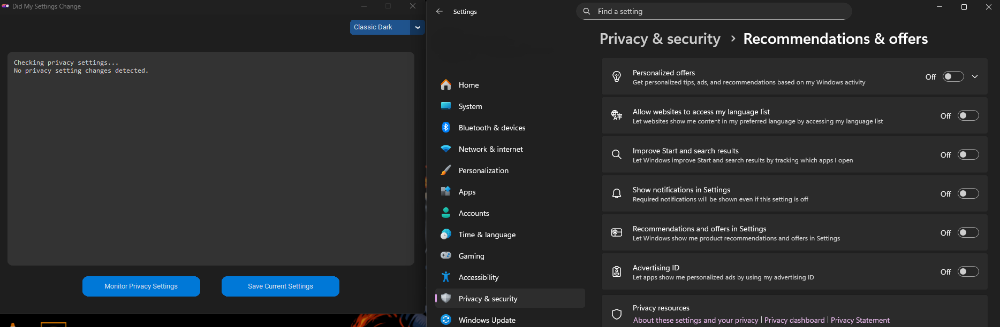
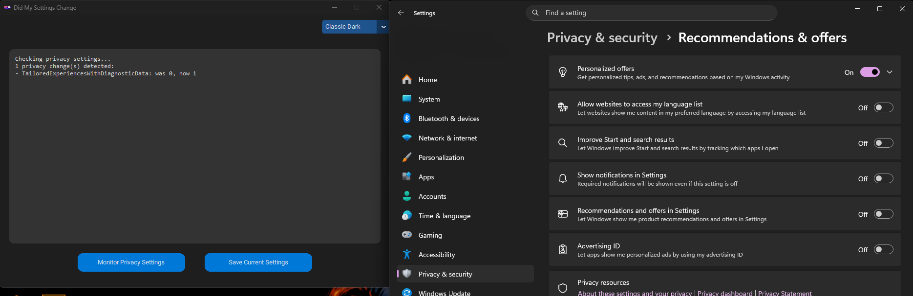

# DidMySettingsChange


Microsoft has been under heavy scrutiny with how they manage Windows over the years, particularly concerning privacy and telemetry settings. Many users find that after disabling certain settings, these settings are mysteriously re-enabled after updates or without any apparent reason. **DidMySettingsChange** is a Python script designed to help users keep track of their Windows privacy and telemetry settings, ensuring that they stay in control of their privacy without the hassle of manually checking each setting.

## Features

- **Comprehensive Checks**: Automatically scans all known Windows privacy and telemetry settings.
- **Change Detection**: Alerts users if any settings have been changed from their preferred state.
- **Customizable Configuration**: Allows users to specify which settings to monitor.
- **Easy to Use**: Simple command-line interface that provides clear and concise output.
- **Logs and Reports**: Generates detailed logs and reports for auditing and troubleshooting.
- **Fully Fledged UI Mode** A fully fledged UI mode for simple use of the program.

## Installation

1. **Download Release**
2. **Unzip the Contents**
3. **Install Dependencies** Application now uses a fully fledge UI popup window that will check for depencies needed and download them for you!
4. **Run the .py script or run the EXE**
5. **Repeat Step 4 After Installing Windows Updates**

## How it Works + Usage

The usage of tool is simple. You run the tool once. Click on the "Save Current Settings" button. It will store all the current settings inside a database file to be used as a snapshot. Then you would run the tool again if say there was a windows update. 

To run the script, navigate to the directory where you unzipped the release files and use the following command:

"python DidMySettingsChange.py" in command prompt. Make sure you have the latest version of python is installed on your system or it will NOT work.

The script will then check all relevant settings and provide a report on any changes detected after you run the script again.

## Dependencies installer window  🟢 *NEW*

Users no longer need to install depencies using the terminal. A GUI popup will automatically check and prompt the user to download the necessary dependencies if needed starting with V1.0.0.8

## Bat & EXE mode

To make the tool easier to use, simply run **RunDMSC.bat** or **DMSC.exe** file and the tool will run automatically!

## Configuration

You can customize which settings to monitor by editing the config.json file. This file contains a list of settings and their expected states. For example:

```json
{
    "Telemetry": {
        "path": "HKLM:\\Software\\Policies\\Microsoft\\Windows\\DataCollection",
        "name": "AllowTelemetry",
        "expected_value": "0"
    },
    "AdvertisingID": {
        "path": "HKCU:\\Software\\Microsoft\\Windows\\CurrentVersion\\AdvertisingInfo",
        "name": "Enabled",
        "expected_value": "0"
    },
    "Location": {
        "path": "HKLM:\\System\\CurrentControlSet\\Services\\lfsvc\\Service\\Configuration",
        "name": "Status",
        "expected_value": "Disabled"
    }
    // Add more settings as needed
}
```

Modify the values as per your preferences before running the script.

## 🖼️ Before & After – Example Output

Here's a visual example of how **DidMySettingsChange** detects changes in your system settings:

### 🔹 Before (Normal State)



The setting is in its expected state.

---

### 🔸 After (Setting Changed)



A change was detected! The tool flags this with both a report and a log entry so you can act accordingly.


## For Windows Recall Users

Windows has recall enabled on some PCs now. This won't apply to most users so if the script does not find that Windows recall is installed on the users computer, it will be ignored :)
                                        
## Contributing

I welcome any contributions from the community! If you'd like to contribute, please follow these steps:

1.    **Fork the repository.**
2.    **Create a new branch for your feature or bugfix.**
3.    **Commit your changes with descriptive messages.**
4.    **Push your branch and create a pull request.**

## Issues

If you encounter any issues or have suggestions for improvements, please open an issue on GitHub. I would greatly appreciate your feedback and contributions to make "DidMySettingsChange" better!

